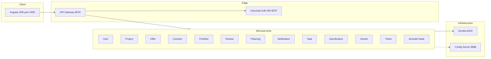

# Architecture

High-level view of the Smart Freelance platform: how the Angular client, API Gateway, and backend services fit together.

## Component diagram



## ASCII overview (matches root README spirit)

```
┌─────────────┐     ┌──────────────┐     ┌────────────────────────────────────────────┐
│   Angular   │──── │ API Gateway  │──── │ Microservices + Keycloak auth integration  │
│  (4200)     │     │   (8078)     │     │ User, Project, Offer, Contract, Portfolio  │
└─────────────┘     └──────────────┘     │ Review, Planning, Notification, Task, …    │
                           │             └────────────────────────────────────────────┘
                    ┌──────┴──────┐
                    │   Config    │     Eureka (8420) for registration / discovery
                    │   Server    │     where services use it
                    │   (8888)    │
                    └─────────────┘
```

## Startup order

1. **MySQL** — services use port `3307` (see [services-and-ports.md](services-and-ports.md)).
2. **Eureka** — `backEnd/Eureka` (port **8420**).
3. **Config Server** (optional for some services, **required** for OFFER/VENDOR bootstrap) — `backEnd/ConfigServer` (**8888**).
4. **API Gateway** — `backEnd/apiGateway` (**8078**).
5. **Keycloak** (realm `smart-freelance`) — standalone; see [backEnd/KeyCloak/README.md](../backEnd/KeyCloak/README.md).
6. **Keycloak auth microservice** — `backEnd/KeyCloak` Spring Boot app (**8079**).
7. **Microservices** — start those your feature needs; gateway routes document required prefixes in [api-gateway.md](api-gateway.md).

## Cross-service behaviour (known)

- **Review → Notification** when a review response is created (notifies the other party).
- **Planning / Task / Offer → Notification** for relevant user events.
- **Task** can call **AImodel** (Ollama) for AI-assisted task flows; gateway uses extended timeouts for those paths.

## CORS

The gateway allows browser calls from `http://localhost:4200` and `http://127.0.0.1:4200` with credentials. See [api-gateway.md](api-gateway.md).

## Further reading

- [backend-infrastructure.md](backend-infrastructure.md) — Eureka, Config, Gateway, auth service roles.
- [services-and-ports.md](services-and-ports.md) — authoritative port and database list.
- [frontend.md](frontend.md) — how the SPA talks to the gateway.
