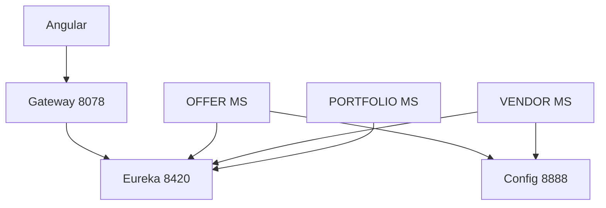

# Backend infrastructure

Java/Spring modules that support the microservices: discovery, configuration, routing, and authentication integration.

## Eureka — service discovery

- **Path**: [backEnd/Eureka](../backEnd/Eureka)
- **Port**: **8420**
- **Role**: Service registry. Services that set `eureka.client.register-with-eureka=true` appear here; the API Gateway can resolve `lb://SERVICE_ID` routes to instances.

Dashboard (local): `http://localhost:8420`

## Config Server — centralised configuration

- **Path**: [backEnd/ConfigServer](../backEnd/ConfigServer)
- **Port**: **8888**
- **Role**: Serves `*.properties` from `src/main/resources/config/` to clients that import the config server (e.g. **OFFER**, **VENDOR** bootstrap via `spring.config.import=configserver:http://localhost:8888`).

Some microservices use `optional:configserver:...` so they can start without Config Server; **OFFER** and **VENDOR** expect Config Server for their main `server.port` and datasource settings.

Start Eureka **before** Config Server if profiles depend on discovery (typical local setup starts Eureka first).

## API Gateway

- **Path**: [backEnd/apiGateway](../backEnd/apiGateway)
- **Port**: **8078**
- **Role**: Single entry point for the frontend; CORS, routing, timeouts. See [api-gateway.md](api-gateway.md).

## Keycloak auth microservice

- **Path**: [backEnd/KeyCloak](../backEnd/KeyCloak)
- **Port**: **8079** (`spring.application.name=keycloak-auth`)
- **Role**: Spring Boot facade for login/signup/token flows against a standalone **Keycloak** (e.g. `localhost:8080`, realm `smart-freelance`). Setup: [backEnd/KeyCloak/README.md](../backEnd/KeyCloak/README.md).

The gateway exposes it under `/keycloak-auth/**`.

## Typical local dependency graph

## Related documentation

- [architecture.md](architecture.md) — startup order and diagrams.
- [services-and-ports.md](services-and-ports.md) — all service ports and databases.
