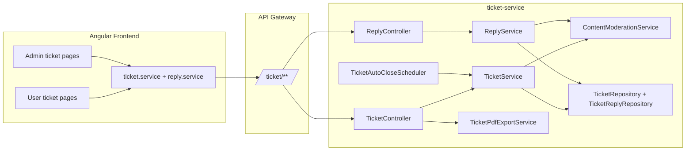

# Ticket Microservice and Angular Feature Guide

This document explains the implemented support-ticket features across the backend microservice and Angular frontend, with direct code mapping.

## 1) Architecture Overview

- Frontend uses gateway prefix `.../ticket` from [`frontend/smart-freelance-app/src/app/core/services/ticket.service.ts`](../frontend/smart-freelance-app/src/app/core/services/ticket.service.ts).
- Backend service is `ticket` on port `8094` from [`backEnd/Microservices/ticket-service/src/main/resources/application.properties`](../backEnd/Microservices/ticket-service/src/main/resources/application.properties).

## 2) Backend Feature Catalog

### 2.1 Ticket domain model

Primary entity: [`Ticket`](../backEnd/Microservices/ticket-service/src/main/java/com/esprit/ticket/entity/Ticket.java)

Implemented fields include:
- Core: `id`, `userId`, `subject`, `status`, `priority`, `createdAt`, `lastActivityAt`
- Assignment: `assignedAdminId`, `assignedAdminName`, `assignedAt`
- SLA/time: `firstResponseAt`, `responseTimeMinutes`, `resolvedAt`
- Reopen tracking: `reopenCount`, `lastReopenedAt`

Enums:
- [`TicketStatus`](../backEnd/Microservices/ticket-service/src/main/java/com/esprit/ticket/domain/TicketStatus.java)
- [`TicketPriority`](../backEnd/Microservices/ticket-service/src/main/java/com/esprit/ticket/domain/TicketPriority.java)

### 2.2 Reply domain model

Primary entity: [`TicketReply`](../backEnd/Microservices/ticket-service/src/main/java/com/esprit/ticket/entity/TicketReply.java)

Implemented fields include:
- Core: `id`, `ticket`, `message`, `sender`, `authorUserId`, `createdAt`
- Read-state: `readByUser`, `readByAdmin`

Enum:
- [`ReplySender`](../backEnd/Microservices/ticket-service/src/main/java/com/esprit/ticket/domain/ReplySender.java)

### 2.3 Ticket lifecycle (CRUD + admin operations)

Main logic lives in [`TicketService`](../backEnd/Microservices/ticket-service/src/main/java/com/esprit/ticket/service/TicketService.java):
- Create ticket with validation/moderation and anti-spam guard
- Read single ticket with access checks
- List tickets with paging/filter/sort (admin all / user own)
- Update ticket (blocked if closed)
- Close ticket (admin)
- Reopen ticket (owner or admin, limited to once)
- Delete ticket (admin)
- Assign/unassign ticket to admin

Controller exposure is in [`TicketController`](../backEnd/Microservices/ticket-service/src/main/java/com/esprit/ticket/controller/TicketController.java).

### 2.4 Reply lifecycle (CRUD)

Main logic in [`ReplyService`](../backEnd/Microservices/ticket-service/src/main/java/com/esprit/ticket/service/ReplyService.java):
- Add reply (with access control and moderation)
- Get replies by ticket
- Update reply (author only)
- Delete reply (author or admin)

Endpoints are exposed by [`ReplyController`](../backEnd/Microservices/ticket-service/src/main/java/com/esprit/ticket/controller/ReplyController.java).

### 2.5 SLA and response-time behavior

Implemented in [`ReplyService`](../backEnd/Microservices/ticket-service/src/main/java/com/esprit/ticket/service/ReplyService.java):
- First human admin reply sets `firstResponseAt`
- Computes `responseTimeMinutes` from ticket creation
- If `responseTimeMinutes > 120`, priority is forced to `HIGH`
- System welcome message is excluded using [`TicketConstants.SYSTEM_AUTHOR_USER_ID`](../backEnd/Microservices/ticket-service/src/main/java/com/esprit/ticket/TicketConstants.java)

### 2.6 Welcome automatic message

On ticket creation, [`TicketService`](../backEnd/Microservices/ticket-service/src/main/java/com/esprit/ticket/service/TicketService.java) inserts a system reply using:
- [`TicketConstants.WELCOME_REPLY_MESSAGE`](../backEnd/Microservices/ticket-service/src/main/java/com/esprit/ticket/TicketConstants.java)
- Sender = `ADMIN`, `authorUserId = 0`

### 2.7 Spam protection

Implemented in [`TicketService`](../backEnd/Microservices/ticket-service/src/main/java/com/esprit/ticket/service/TicketService.java):
- Counts tickets created by user in the last 10 minutes
- Blocks creation when threshold `>= 5`

Repository query:
- [`TicketRepository.countByUserIdAndCreatedAtAfter(...)`](../backEnd/Microservices/ticket-service/src/main/java/com/esprit/ticket/repository/TicketRepository.java)

### 2.8 Auto-close scheduler

- Scheduler: [`TicketAutoCloseScheduler`](../backEnd/Microservices/ticket-service/src/main/java/com/esprit/ticket/scheduler/TicketAutoCloseScheduler.java)
- Service method: `autoCloseInactiveOpenTickets()` in [`TicketService`](../backEnd/Microservices/ticket-service/src/main/java/com/esprit/ticket/service/TicketService.java)
- Configurable by:
  - `app.ticket.auto-close-after-hours`
  - `app.ticket.auto-close-cron`
  in [`application.properties`](../backEnd/Microservices/ticket-service/src/main/resources/application.properties)

### 2.9 Unread/read tracking

Implemented in [`ReplyService`](../backEnd/Microservices/ticket-service/src/main/java/com/esprit/ticket/service/ReplyService.java) + [`TicketReplyRepository`](../backEnd/Microservices/ticket-service/src/main/java/com/esprit/ticket/repository/TicketReplyRepository.java):
- Mark read for viewer role (`readByUser` or `readByAdmin`)
- Aggregate unread counts per ticket for user/admin views

Ticket-level endpoint is in [`TicketController`](../backEnd/Microservices/ticket-service/src/main/java/com/esprit/ticket/controller/TicketController.java):
- `PUT /tickets/{id}/read`
- `GET /tickets/unread-counts`

### 2.10 Reopen rule

Implemented in [`TicketService.reopen(...)`](../backEnd/Microservices/ticket-service/src/main/java/com/esprit/ticket/service/TicketService.java):
- Allowed for ticket owner or admin
- Only when status is `CLOSED`
- Limited to one reopen (`reopenCount < 1`)

### 2.11 Content moderation

Implemented in [`ContentModerationService`](../backEnd/Microservices/ticket-service/src/main/java/com/esprit/ticket/service/ContentModerationService.java):
- Detects profanity via PurgoMalum `containsprofanity`
- Default behavior: reject profane text (`400`)
- Optional behavior: censor via PurgoMalum `/plain`

Config flags in [`application.properties`](../backEnd/Microservices/ticket-service/src/main/resources/application.properties):
- `app.moderation.enabled`
- `app.moderation.reject-on-profanity`
- `app.moderation.base-url`

### 2.12 Statistics and monthly analytics

Implemented in [`TicketService`](../backEnd/Microservices/ticket-service/src/main/java/com/esprit/ticket/service/TicketService.java):
- Global stats: total/open/closed/avg response time
- Monthly grouped counts

Repository support in [`TicketRepository`](../backEnd/Microservices/ticket-service/src/main/java/com/esprit/ticket/repository/TicketRepository.java).

### 2.13 PDF export

Implemented in [`TicketPdfExportService`](../backEnd/Microservices/ticket-service/src/main/java/com/esprit/ticket/service/TicketPdfExportService.java):
- Uses Apache PDFBox
- Includes executive summary, priority distribution, monthly table, and open backlog snapshot

Endpoint:
- `GET /tickets/export/pdf` in [`TicketController`](../backEnd/Microservices/ticket-service/src/main/java/com/esprit/ticket/controller/TicketController.java)

### 2.14 Notifications

Implemented in [`TicketNotificationService`](../backEnd/Microservices/ticket-service/src/main/java/com/esprit/ticket/service/TicketNotificationService.java):
- Notifies user/inbox for ticket creation, close, reopen, and replies
- Uses `NotificationClient` and `NotificationRequestDto`

### 2.15 Security and authorization

Configured in [`SecurityConfig`](../backEnd/Microservices/ticket-service/src/main/java/com/esprit/ticket/config/SecurityConfig.java):
- JWT Resource Server
- Keycloak roles mapped to Spring `ROLE_*`
- Stateless security
- Method-level role checks enabled

Current-user resolution is in [`CurrentUserService`](../backEnd/Microservices/ticket-service/src/main/java/com/esprit/ticket/security/CurrentUserService.java).

## 3) API Endpoint Map

### Ticket endpoints (`/tickets`)

From [`TicketController`](../backEnd/Microservices/ticket-service/src/main/java/com/esprit/ticket/controller/TicketController.java):

- `POST /tickets` - create ticket
- `GET /tickets` - admin paginated list with filters/sort/search
- `GET /tickets/{id}` - ticket by id (owner/admin access rules)
- `GET /tickets/user/{userId}` - paginated user-scoped ticket list
- `PUT /tickets/{id}` - update ticket (open only)
- `PUT /tickets/{id}/close` - close ticket (admin)
- `PUT /tickets/{id}/reopen` - reopen ticket (owner or admin, once)
- `PUT /tickets/{id}/assign` - assign to current admin
- `PUT /tickets/{id}/unassign` - unassign admin
- `PUT /tickets/{id}/read` - mark replies read for caller perspective
- `DELETE /tickets/{id}` - delete ticket (admin)
- `GET /tickets/unread-counts` - unread counts per ticket
- `GET /tickets/stats` - aggregate stats (admin)
- `GET /tickets/stats/monthly` - monthly counts (admin)
- `GET /tickets/export/pdf` - PDF report (admin)

### Reply endpoints (`/replies`)

From [`ReplyController`](../backEnd/Microservices/ticket-service/src/main/java/com/esprit/ticket/controller/ReplyController.java):

- `POST /replies` - add reply
- `GET /replies/{ticketId}` - list replies by ticket
- `PUT /replies/{id}` - update reply (author)
- `DELETE /replies/{id}` - delete reply (author/admin)

## 4) Backend Code Map by Layer

### Entities and constants
- [`Ticket`](../backEnd/Microservices/ticket-service/src/main/java/com/esprit/ticket/entity/Ticket.java)
- [`TicketReply`](../backEnd/Microservices/ticket-service/src/main/java/com/esprit/ticket/entity/TicketReply.java)
- [`TicketConstants`](../backEnd/Microservices/ticket-service/src/main/java/com/esprit/ticket/TicketConstants.java)

### DTOs
- Ticket DTOs under [`backEnd/Microservices/ticket-service/src/main/java/com/esprit/ticket/dto/ticket`](../backEnd/Microservices/ticket-service/src/main/java/com/esprit/ticket/dto/ticket)
- Reply DTOs under [`backEnd/Microservices/ticket-service/src/main/java/com/esprit/ticket/dto/reply`](../backEnd/Microservices/ticket-service/src/main/java/com/esprit/ticket/dto/reply)
- Notification DTO [`NotificationRequestDto`](../backEnd/Microservices/ticket-service/src/main/java/com/esprit/ticket/dto/notification/NotificationRequestDto.java)

### Repositories
- [`TicketRepository`](../backEnd/Microservices/ticket-service/src/main/java/com/esprit/ticket/repository/TicketRepository.java)
- [`TicketReplyRepository`](../backEnd/Microservices/ticket-service/src/main/java/com/esprit/ticket/repository/TicketReplyRepository.java)

### Services
- [`TicketService`](../backEnd/Microservices/ticket-service/src/main/java/com/esprit/ticket/service/TicketService.java)
- [`ReplyService`](../backEnd/Microservices/ticket-service/src/main/java/com/esprit/ticket/service/ReplyService.java)
- [`ContentModerationService`](../backEnd/Microservices/ticket-service/src/main/java/com/esprit/ticket/service/ContentModerationService.java)
- [`TicketPdfExportService`](../backEnd/Microservices/ticket-service/src/main/java/com/esprit/ticket/service/TicketPdfExportService.java)
- [`TicketNotificationService`](../backEnd/Microservices/ticket-service/src/main/java/com/esprit/ticket/service/TicketNotificationService.java)

### Controllers
- [`TicketController`](../backEnd/Microservices/ticket-service/src/main/java/com/esprit/ticket/controller/TicketController.java)
- [`ReplyController`](../backEnd/Microservices/ticket-service/src/main/java/com/esprit/ticket/controller/ReplyController.java)

### Scheduler and security
- [`TicketAutoCloseScheduler`](../backEnd/Microservices/ticket-service/src/main/java/com/esprit/ticket/scheduler/TicketAutoCloseScheduler.java)
- [`SecurityConfig`](../backEnd/Microservices/ticket-service/src/main/java/com/esprit/ticket/config/SecurityConfig.java)
- [`CurrentUserService`](../backEnd/Microservices/ticket-service/src/main/java/com/esprit/ticket/security/CurrentUserService.java)

## 5) Frontend Mapping (Angular)

### Core API services
- [`ticket.service.ts`](../frontend/smart-freelance-app/src/app/core/services/ticket.service.ts)
- [`reply.service.ts`](../frontend/smart-freelance-app/src/app/core/services/reply.service.ts)

These services map UI actions directly to ticket/reply endpoints and expose typed interfaces (`Ticket`, `TicketPageResponse`, `TicketStats`, etc.).

### User-facing ticket pages
- List/search/filter/pagination/unread/reopen from list: [`ticket-user.ts`](../frontend/smart-freelance-app/src/app/pages/dashboard/tickets/ticket-user/ticket-user.ts)
- Create/edit form: [`ticket-form.ts`](../frontend/smart-freelance-app/src/app/pages/dashboard/tickets/ticket-form/ticket-form.ts)
- Conversation thread, mark-read, edit/delete own replies, reopen from detail: [`ticket-detail.ts`](../frontend/smart-freelance-app/src/app/pages/dashboard/tickets/ticket-detail/ticket-detail.ts)

### Admin ticket pages
- Queue with paging/filter/sort/search/unread/assign/unassign/close/reopen actions: [`ticket-list.ts`](../frontend/smart-freelance-app/src/app/pages/admin/ticket-management/ticket-list/ticket-list.ts)
- Ticket handling view (reply, close, reopen, delete, assignment): [`ticket-detail.ts`](../frontend/smart-freelance-app/src/app/pages/admin/ticket-management/ticket-detail/ticket-detail.ts)
- Ticket stats dashboard + monthly chart + PDF download: [`ticket-stats.ts`](../frontend/smart-freelance-app/src/app/pages/admin/ticket-management/ticket-stats/ticket-stats.ts)

### Routing and navigation
- Dashboard ticket routes and admin ticket routes: [`app.routes.ts`](../frontend/smart-freelance-app/src/app/app.routes.ts)
- Sidebar entries for Support/Tickets: [`sidebar.ts`](../frontend/smart-freelance-app/src/app/shared/components/sidebar/sidebar.ts)

## 6) Behavior Notes and Constraints

- Access control: Non-admin users can access only their own tickets; admin can access all.
- Reply edit constraint: Only reply author can update; author or admin can delete.
- Closed-ticket restriction: New replies and ticket updates are blocked when closed.
- Reopen policy: Ticket can be reopened once (`reopenCount` guard), now allowed for owner or admin.
- Unread semantics:
  - User unread = admin replies with `readByUser=false`
  - Admin unread = user replies with `readByAdmin=false`
- SLA trigger: First non-system admin reply defines first response time and may escalate priority to `HIGH`.
- Moderation policy: Reject profane content by default; optional censor mode available.
- Scheduler policy: Open tickets with inactivity beyond configured threshold are auto-closed.

## 7) Quick Feature-to-File Index

- Create ticket + anti-spam + welcome reply: [`TicketService#create`](../backEnd/Microservices/ticket-service/src/main/java/com/esprit/ticket/service/TicketService.java)
- Reply + SLA + notification: [`ReplyService#addReply`](../backEnd/Microservices/ticket-service/src/main/java/com/esprit/ticket/service/ReplyService.java)
- Reopen logic: [`TicketService#reopen`](../backEnd/Microservices/ticket-service/src/main/java/com/esprit/ticket/service/TicketService.java)
- Mark read: [`TicketService#markTicketRepliesRead`](../backEnd/Microservices/ticket-service/src/main/java/com/esprit/ticket/service/TicketService.java), [`ReplyService#markRepliesReadForViewer`](../backEnd/Microservices/ticket-service/src/main/java/com/esprit/ticket/service/ReplyService.java)
- Unread aggregates: [`TicketReplyRepository`](../backEnd/Microservices/ticket-service/src/main/java/com/esprit/ticket/repository/TicketReplyRepository.java)
- Stats/monthly: [`TicketService#getStats`](../backEnd/Microservices/ticket-service/src/main/java/com/esprit/ticket/service/TicketService.java), [`TicketService#getMonthlyStats`](../backEnd/Microservices/ticket-service/src/main/java/com/esprit/ticket/service/TicketService.java)
- PDF report: [`TicketPdfExportService`](../backEnd/Microservices/ticket-service/src/main/java/com/esprit/ticket/service/TicketPdfExportService.java)
- Auto-close scheduler: [`TicketAutoCloseScheduler`](../backEnd/Microservices/ticket-service/src/main/java/com/esprit/ticket/scheduler/TicketAutoCloseScheduler.java)
